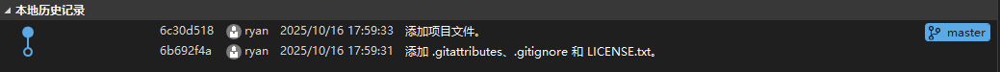

# Word版本控制VSTO插件 WordVersionControl(WVC) VSTO Plugin v0.1 开发文档

## 1. 宗旨
本插件旨在实现将基于git的版本控制系统接入以Microsoft Word为代表的Microsoft Office办公套件中, 实现较原生功能更加便捷可靠的版本管理. 


## 2. Prerequisite
- Windows
- Git

## 3. 主要功能

1. 查看历史
> 点击`查看历史`按钮, 弹出侧边栏, 里面记录当前分支下的所有历史提交记录, 就像下图一样: 

> 每条提交记录包括:
>- 提交 id (前8字符)
>- 用户
>- 时间
>- 提交消息
> 
> 当点击某个提交记录时, 将自动打开该记录与当前分支所在记录的对比文档


2. 文档对比
> 侧边栏弹出历史提交文件以及当前暂存区文件, 选择任意两个文件实现前后对比

3. 提交
> 确保暂存区文档与当前文档的已修订版本实现同步后, 添加到git暂存区并提交(弹出消息窗口)

4. 自动保存
> 实现简单的定时保存


```
当编写文档时, 将自动进入word中的审阅修订模式(当然你也可以关掉, 不过这样就少了一个暂存环节), 此时对文档的所有更改都会被word跟踪. 而WVC将其视为工作区, 只有当用户确认修改后才会进入暂存区, 以待后续提交.

对于每一个文档而言, 维护一个git仓库与暂存区文件, 暂存区文件与当前文档的已修订版本实现同步(但无需实时同步, 只需在进行git相关操作之前同步即可)

在首次创建git仓库时, 在每个文档中创建一个全局唯一id属性(wvc_id), 并在用户目录下创建一个文件夹`.wvc`, 其中存储结构如下:

----.wvc
|
|----fa3e8e2d-3f4a-4bc8-9410-c14d083ad2cf(wvc_id)
    |
    |----.git
    |----__staged_version__.docx
    |----filename
    |----.tmp
        |
        |----__old__.docx
        |----__new__.docx
        |...
|
|----...

这个.wvc文件夹中存储当前用户的所有使用WVC的文档所产生的变更, 该文件夹一般情况下对用户不可见, 当用户在文档中产生WVC相关操作时, WVC通过`wvc_id`找到对应仓库并实施变更.

filename为保存文档名的文本文件

重要: 位于.wvc中的所有文件不启用任何功能
```


## 待实现功能

1. 多分支切换/合并分支


## 架构设计

